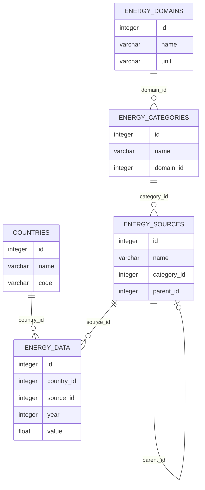

# Energy-Statapp

Aplikacja webowa służąca do przeglądania, analizowania i wizualizacji danych statystycznych dotyczących zużycia energii w różnych krajach.

## 🎯 Cel projektu

Celem projektu jest stworzenie interaktywnego systemu, który umożliwia użytkownikom analizę danych energetycznych w podziale na kraje, źródła energii, kategorie oraz domeny. Dane importowane są z pliku Excel i prezentowane w postaci tabel oraz wykresów.

## ✅ Funkcjonalności

- Import danych z arkusza Excel.
- Przeglądanie statystyk energetycznych w formie tabel.
- Tworzenie interaktywnych wykresów (na podstawie wybranych kryteriów).
- Eksport danych i wykresów do pliku PDF.
- Logowanie i autoryzacja użytkowników.
- Panel administratora (zarządzanie danymi i użytkownikami).

## 🛠️ Technologie

- **Frontend:**  
  - HTML
  - CSS
  - JavaScript  

- **Backend:**  
  - Django
  - Django REST Framework (dla API) 

- **Baza danych:**  
  - PostgreSQL
 
## 📂 Project Structure

**ERD Diagram**

