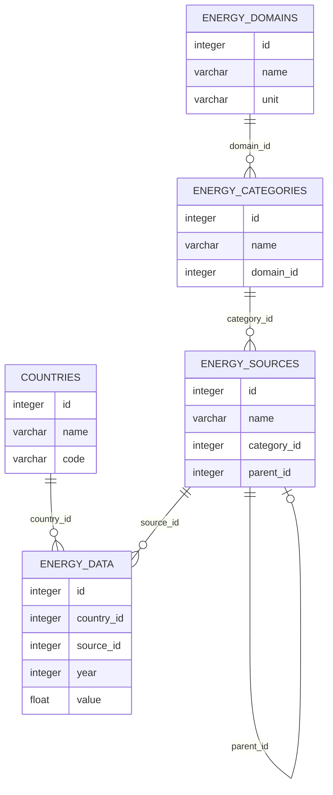

# Energy-Statapp

Aplikacja webowa służąca do przeglądania, analizowania oraz wizualizacji danych statystycznych dotyczących zużycia energii w różnych krajach Europy.

## 🎯 Cel projektu

Celem projektu jest stworzenie interaktywnej platformy umożliwiającej użytkownikom analizę danych energetycznych w podziale na kraje, źródła energii, kategorie oraz obszary tematyczne. Dane są importowane z pliku Excel i prezentowane w formie czytelnych tabel oraz dynamicznych wykresów.

## ✅ Funkcjonalności

- Interaktywne wykresy – dynamiczna wizualizacja danych.
- Porównania krajów – szybkie zestawienia statystyk między wybranymi państwami.
- Mapa ciepła (heatmap) – graficzne przedstawienie danych na mapie Europy.
- Eksport wykresów – możliwość zapisania grafik w formacie PNG.

## 🌍 O platformie
Energy-Statapp pozwala na wygodne poznawanie danych energetycznych krajów europejskich. Dzięki interaktywnym wykresom i porównaniom między krajami, użytkownicy mogą łatwo analizować trendy i różnice w produkcji, zużyciu oraz transformacji energii.

## 🛠️ Technologie

- **Frontend:**  
  - HTML
  - CSS
  - JavaScript  

- **Backend:**  
  - Django
  - Django REST Framework (dla API) 

- **Baza danych:**  
  - SQLite3
    
- **Predykcja:**  
  - collections.defaultdict
  - numpy
    
## 📂 Project Structure

**ERD Diagram**

```mermaid
erDiagram
    COUNTRIES {
        integer id
        varchar name
        varchar code
    }
    ENERGY_DOMAINS {
        integer id
        varchar name
        varchar unit
    }
    ENERGY_CATEGORIES {
        integer id
        varchar name
        integer domain_id
    }
    ENERGY_SOURCES {
        integer id
        varchar name
        integer category_id
        integer parent_id
    }
    ENERGY_DATA {
        integer id
        integer country_id
        integer source_id
        integer year
        float value
    }

    COUNTRIES ||--o{ ENERGY_DATA : "country_id"
    ENERGY_DOMAINS ||--o{ ENERGY_CATEGORIES : "domain_id"
    ENERGY_CATEGORIES ||--o{ ENERGY_SOURCES : "category_id"
    ENERGY_SOURCES ||--o{ ENERGY_DATA : "source_id"
    ENERGY_SOURCES ||--o| ENERGY_SOURCES : "parent_id"
```
